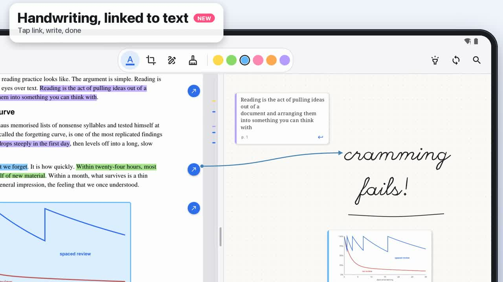
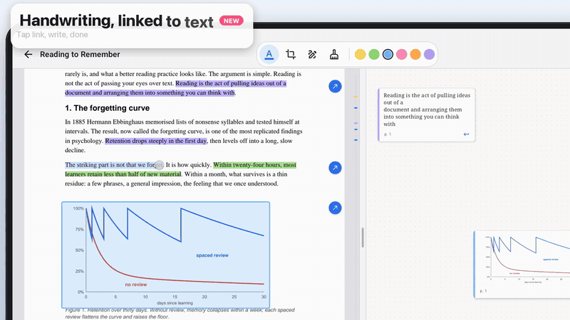

# Liquid Reader

A PDF reader for Android tablets that lets you take a document apart while you read it. Highlight with a stylus, drag passages onto an infinite canvas, write notes by hand that stay linked to the text, and pinch the document to fold away everything you don't need.

[](demo/LiquidReader_v2.mp4)

**[▶ Watch the 80-second demo](demo/LiquidReader_v2.mp4)**



## Features

**Reading and extracting**
- **Pen-first selection.** A stylus selects text directly with no long-press; fingers use long-press and drag. Selections snap to whole words.
- **Highlights** in six colours.
- **Excerpts.** Drag a selection onto the canvas, or tap *Excerpt* and it finds a free spot. Every card shows its page and has a button that jumps back to the source, where the passage flashes.
- **Region clips.** Draw a box around a chart or figure to turn it into an image card.
- **Comments and notes.** Comment on a passage to get a sticky note anchored to it, or double-tap the canvas for a free-standing note.

**Thinking on the canvas**
- **Infinite canvas** with pan, pinch-zoom and momentum.
- **Card links.** Drag the blue handle from one card to another to connect them.
- **Handwriting linked to text.** Tap the link button on a selection, then write. The ink is tethered to the passage, an arrow crosses the divider, and a pen marker appears in the margin. You can also go the other way: select ink and choose *Link to text*.
- **Follow mode.** Scroll either pane and the other glides along so linked notes stay level with their passage.
- **Notebook mode.** Lock the canvas to page width with blank, ruled, grid or dot paper.
- **Ink and eraser** on both the page and the canvas. Pen strokes are pressure-sensitive, and the stylus's eraser end erases.

**Navigating long documents**
- **Pinch to collapse.** A vertical two-finger pinch folds the text between your fingers into a thin band, so distant passages sit side by side. Spread or tap to reopen.
- **Highlights only.** One tap collapses the document down to just your highlights.
- **Search** with hit marks on the scroll rail, next and previous, and *collapse to results*.
- **Scroll rail** showing every highlight, card and search hit; tap it to jump.
- **Adjustable split** between document and canvas.
- **Autosave.** Every change is saved as you go, and the library shows each project with its thumbnail and excerpt count.

## Requirements

- An Android tablet, or a tablet emulator, running **Android 11 (API 30)** or later.
- Text selection and search use the `PdfRenderer` text APIs from **Android 15 / SDK extension S 13**. On older versions documents still render, and drawing, region clips and the canvas still work.
- A stylus is optional. With one, fingers pan and zoom while the pen writes and selects.

## Download

Every push to `main` builds a debug APK with GitHub Actions. Download it from the **Artifacts** section of the latest [Build APK run](https://github.com/Koosh0610/liquid-reader/actions/workflows/build-apk.yml). Pushing a version tag (`git tag v0.1 && git push --tags`) attaches the APK to a [GitHub Release](https://github.com/Koosh0610/liquid-reader/releases).

## Build and run

You need JDK 17–21 and the Android SDK (platform 35). Gradle 8.9 can't run on JDK 22 or newer.

```sh
./gradlew assembleDebug
adb install -r app/build/outputs/apk/debug/app-debug.apk
```

Or open the folder in Android Studio and run the `app` configuration. Run the unit tests (collapse-range logic) with:

```sh
./gradlew test
```

## How it's built

Jetpack Compose (Material 3) with no other dependencies beyond AndroidX. PDFs are rendered with the platform `PdfRenderer`.

| File | What it does |
| --- | --- |
| `MainActivity.kt` | Switches between the library and the reader |
| `LibraryScreen.kt` | Project grid, PDF import, delete |
| `ReaderScreen.kt` | Reader state (`ReaderUi`), top bar, search, selection popup, link arrows, follow mode |
| `DocumentPane.kt` | Page rendering, highlights, ink, region clips, pinch-to-collapse, margin markers, scroll rail |
| `Workspace.kt` | Canvas and notebook, cards, card links, handwriting, paper styles |
| `Model.kt` | Project data, JSON persistence, collapse-range maths |
| `Pdf.kt` | `PdfRenderer` wrapper: bitmap cache, crops, text selection, search |

Each project is a folder in the app's private storage (`files/projects/<uuid>/`). It holds a copy of the PDF, a thumbnail, any clipped images, and a `project.json` with highlights, cards, links, ink, tethers and collapses. Positions in the document are stored as page index plus a fraction of the page, so they survive any zoom level.

## Known limitations

- Ink records one point per frame and ignores the pointer's historical samples, so very fast handwriting can lose detail.
- Projects stay on the device; there's no export or sync yet.

## About the demo video

The demo was recorded on the Android emulator with every gesture scripted: a small native helper replays touch and stylus events with pressure at 120 Hz. It was edited frame by frame in Python, narrated with [Kyutai Pocket TTS](https://github.com/kyutai-labs/pocket-tts) running on-device, and scored with a procedurally generated soundtrack.
